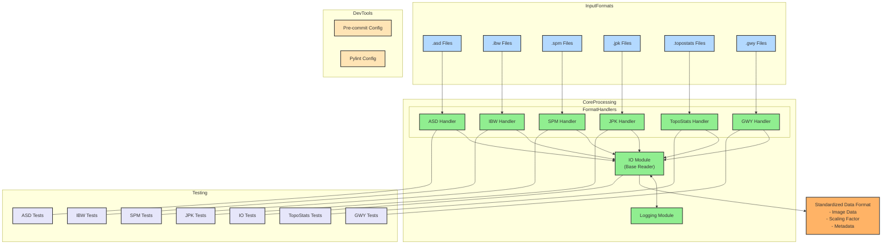

# Workflow

```mermaid
flowchart TB
    %% Styles
    classDef input fill:#b3d9ff,stroke:#333,stroke-width:2px
    classDef core fill:#90EE90,stroke:#333,stroke-width:2px
    classDef output fill:#FFB366,stroke:#333,stroke-width:2px
    classDef test fill:#E6E6FA,stroke:#333,stroke-width:2px
    classDef tools fill:#FFE4B5,stroke:#333,stroke-width:2px

    %% Input Layer
    subgraph InputFormats
        ASD[".asd Files"]:::input
        IBW[".ibw Files"]:::input
        SPM[".spm Files"]:::input
        JPK[".jpk Files"]:::input
        TOPO[".topostats Files"]:::input
        GWY[".gwy Files"]:::input
    end

    %% Core Processing Layer
    subgraph CoreProcessing
        IO["IO Module\n(Base Reader)"]:::core
        LOG["Logging Module"]:::core

        subgraph FormatHandlers
            ASDHandler["ASD Handler"]:::core
            IBWHandler["IBW Handler"]:::core
            SPMHandler["SPM Handler"]:::core
            JPKHandler["JPK Handler"]:::core
            TOPOHandler["TopoStats Handler"]:::core
            GWYHandler["GWY Handler"]:::core
        end
    end

    %% Testing Layer
    subgraph Testing
        IOTest["IO Tests"]:::test
        ASDTest["ASD Tests"]:::test
        IBWTest["IBW Tests"]:::test
        SPMTest["SPM Tests"]:::test
        JPKTest["JPK Tests"]:::test
        TOPOTest["TopoStats Tests"]:::test
        GWYTest["GWY Tests"]:::test
    end

    %% Development Tools
    subgraph DevTools
        PreCommit["Pre-commit Config"]:::tools
        Pylint["Pylint Config"]:::tools
    end

    %% Output Layer
    Output["Standardized Data Format\n- Image Data\n- Scaling Factor\n- Metadata"]:::output

    %% Relationships
    ASD --> ASDHandler
    IBW --> IBWHandler
    SPM --> SPMHandler
    JPK --> JPKHandler
    TOPO --> TOPOHandler
    GWY --> GWYHandler

    ASDHandler --> IO
    IBWHandler --> IO
    SPMHandler --> IO
    JPKHandler --> IO
    TOPOHandler --> IO
    GWYHandler --> IO

    IO <--> LOG
    IO --> Output

    ASDHandler --- ASDTest
    IBWHandler --- IBWTest
    SPMHandler --- SPMTest
    JPKHandler --- JPKTest
    TOPOHandler --- TOPOTest
    GWYHandler --- GWYTest
    IO --- IOTest

    %% Click Events
    click IO "https://github.com/AFM-SPM/AFMReader/blob/main/AFMReader/io.py"
    click LOG "https://github.com/AFM-SPM/AFMReader/blob/main/AFMReader/logging.py"
    click ASDHandler "https://github.com/AFM-SPM/AFMReader/blob/main/AFMReader/asd.py"
    click IBWHandler "https://github.com/AFM-SPM/AFMReader/blob/main/AFMReader/ibw.py"
    click SPMHandler "https://github.com/AFM-SPM/AFMReader/blob/main/AFMReader/spm.py"
    click JPKHandler "https://github.com/AFM-SPM/AFMReader/blob/main/AFMReader/jpk.py"
    click TOPOHandler "https://github.com/AFM-SPM/AFMReader/blob/main/AFMReader/topostats.py"
    click GWYHandler "https://github.com/AFM-SPM/AFMReader/blob/main/AFMReader/gwy.py"
    click ASDTest "https://github.com/AFM-SPM/AFMReader/blob/main/tests/test_asd.py"
    click IBWTest "https://github.com/AFM-SPM/AFMReader/blob/main/tests/test_ibw.py"
    click SPMTest "https://github.com/AFM-SPM/AFMReader/blob/main/tests/test_spm.py"
    click JPKTest "https://github.com/AFM-SPM/AFMReader/blob/main/tests/test_jpk.py"
    click TOPOTest "https://github.com/AFM-SPM/AFMReader/blob/main/tests/test_topostats.py"
    click GWYTest "https://github.com/AFM-SPM/AFMReader/blob/main/tests/test_gwy.py"
    click IOTest "https://github.com/AFM-SPM/AFMReader/blob/main/tests/test_io.py"
    click PreCommit "https://github.com/AFM-SPM/AFMReader/blob/main/.pre-commit-config.yaml"
    click Pylint "https://github.com/AFM-SPM/AFMReader/blob/main/.pylintrc"
```

Generated using [GitDiagram](https://gitdiagram.com/AFM-SPM/AFMReader)
